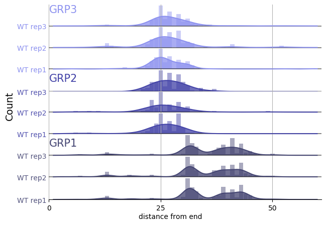
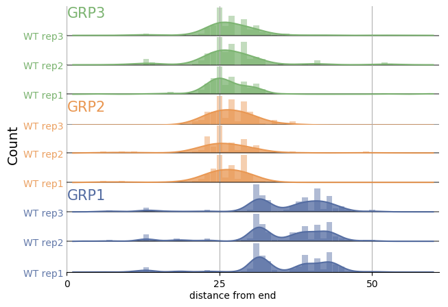

# general_scripted_plotting

Scripts that plot generalized data.

**NOTE:** This repository is just for scripts that have a very broad ability to make plots from generalized data. I have made many other scripts that plot data that aren't here because they are more nuanced. A few of them are referenced below under the section `Plotting scripts for specific purposes`.

Descriptions of the scripts are below:

## plot_panel_bar_plots_with_fit.py
> plots a ratio of expression values across chromosomes or scaffolds of a genome to highlight regions of deviation characteristic of aneuploidy or segmental duplication/deletion.

A Python script to plot panels of bar graphs with curves fit to the data.  It uses lists of lists of x & y data. Each set of x & y values is plotted to a subplot.
This script is my 'hacky' casting of the histogram-generating (actually kernel density estimate curve plot-generating) code of [joypy](https://github.com/sbebo/joypy) as a less automated, fully-customizable plotter of panels of bar graphs with curves fit to the data. (Also vaguely reminiscent of [Seaborn's example of Overlapping densities (‘joy plot’)](https://seaborn.pydata.org/examples/kde_joyplot.html), and [horizontal violin plots that feature 'stacks'](https://seaborn.pydata.org/generated/seaborn.violinplot.html), but where one-sided and set up so can compare more than one.)   
Originally written to be part of a mini-pipeline, [`shepherds_read_starts_at_start_of_origins_thru_to_plotting.py`](https://github.com/fomightez/mini-pipelines), where I plot read starts at the start of origin promoters mined by [`plot_coverage_and_starts.py`]()  Thus, it was written in a manner to make the core function easily imported elsewhere so that the "data" hard coded in the example can be replaced by real data.
Stylistically, it seems others have called this a 'panel of bar charts', see [here](http://support.sas.com/documentation/cdl/en/grstatproc/62603/HTML/default/viewer.htm#a003241944.htm) and so my description/name is an effort to acknowledge that.

INSERT EXAMPLE COMMAND AND RESULTING PLOT HERE.

Two ways to use this script:
- **Edit it to contain your data.**

  Edit the script directly via text editor. Assign your data and asign items like `labels`, `colors`, etc.
  
  Adjust the output image to be in the format you'd like. You may find `.png` best while developing because more easily directly viewed than `svg`; `svg` vector graphics format is more easily sized and adapted.
  
  Excute the edited script with:
  
      python plot_panel_bar_plots_with_fit.py
      
  The script can also simply be pasted into a cell in a Jupyter notebook and then executed as you would any code in a Jupyter notebook, i.e., type `shift-enter` or press `play` button. An example of an edited script pasted into a notebook is included [here](panel_examples/example_edited_data_for_plot_panel_bar_plots_with_fit.ipynb).
  
  
  The resulting image produced is below:

- (**Recommended way ==>**) **Import the function into your own script with your data or your Jupyter notebook with your data.**

  To do this, place the script `plot_panel_bar_plots_with_fit.py` into a directory with your code or place the script in your Jupyter environment dashboard where the notebook is locaed.

  Minimal code outline needed for that approach:

      import matplotlib
      from matplotlib import pyplot as plt
      import plot_panel_bar_plots_with_fit as plt_panel_bar
     
      # assign your data
      
      # assign items like `labels`, `colors`, etc.
      
      ## MAKE PLOT by calling function ####

      fig, axes = plt_panel_bar.plot_data(
          data,
          #plus ettings for options, examples:
          labels=my_data_labels,
          colors=my_label_and_bar_colors, 
          bar_alphas=my_bar_alphas,
          label_alphas=my_label_alphas,
          shared_x_label=shared_x_label,
          shared_y_label=shared_y_label
          # Several other options are available for fully customizing output.
          )

      ### END OF PLOT MAKING #####

      # save or display returned plot in preferend format
      plt.savefig("plot.svg", orientation='landscape') # FOR VECTOR GRAPHICS; useful if merging into Adobe Illustrator.
      plt.savefig("plot.png") # may be best for development phase as viewable directly in more environments
      plt.show() # <=== Use that when placed in a Jupyter notebook
  
   See [`shepherds_read_starts_at_start_of_origins_thru_to_plotting.py`](https://github.com/fomightez/mini-pipelines) for a full example implementing the `import` approach.
   
The resulting images produced are below in the two color options, with the second option selectable by editing the script [`shepherds_read_starts_at_start_of_origins_thru_to_plotting.py`](https://github.com/fomightez/mini-pipelines) further:

## Plotting scripts for specific purposes

I have made many other scripts that plot data that aren't in this repository becauase they are for specific purposes or deal with specific forms of data. 

Below are links to a few of these to aid in organization:

- [plot_expression_across_chromosomes](https://github.com/fomightez/sequencework/tree/master/plot_expression_across_chromosomes)
- [plot_read_data](https://github.com/fomightez/sequencework/tree/master/plot_read_data)
- [scripts to make Venn diagrams for overlapping words or gene data](https://github.com/fomightez/text_mining)
- [Jupyter notebook that plots optical density vs. yeast cell density in addition to making related calculations](https://github.com/fomightez/methods_in_yeast_genetics/tree/master/cell_density_estimator)
- [preliminary Peter de Jong attractor plotting in a Jupyter notebook](https://github.com/fomightez/de_jong-jupyter)

RELATED:
I have a [VPython-jupyter repo where I added the plotting package `Seaborn`](https://github.com/fomightez/vpython-jupyter).

### Licensing

The scripts in this repository are licensed under MIT.
