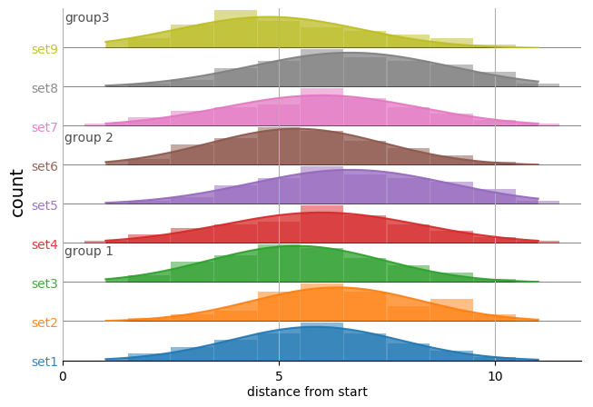

# general_scripted_plotting

Scripts that plot 'generalized' data.

**NOTE:** This repository is just for scripts that have a very broad ability to make plots from 'generalized' data. I have many other scripts/Jupyter notebooks that are more nuanced, and hence not in this repo. A few of them are referenced below under [the section `Plotting scripts for specific purposes`](https://github.com/fomightez/general_scripted_plotting#plotting-scripts-for-specific-purposes).

Descriptions of the scripts are below:

## plot_panel_bar_plots_with_fit.py
> A Python script to plot panels of bar graphs with optional curves fit to the data.  It uses lists of lists of x & y data. Each set of x & y values is plotted to a subplot stacked upon each other subplot in the panel.

This script is my 'hacky' recasting of the histogram-generating (actually kernel density estimate curve plot-generating) code of [joypy](https://github.com/sbebo/joypy) as a less automated, fully-customizable plotter of panels of bar graphs with curves fit to the data. (There might be some more current, more convenient versions than this among the resources I found listed [here](https://github.com/plotly/documentation/issues/1018).) (A fancy, R-based version with vertical color gradient fill is illustrated in [this vignette for devoutsvg](https://coolbutuseless.github.io/package/devoutsvg/articles/svg-with-gradient-fill.html).) (Also reminscent of ridgline plots done in R by ggridges, see [here for an example](https://twitter.com/ClausWilke/status/932764406693482497). Vaguely also reminiscent of [Seaborn's example of Overlapping densities (‘ridge plot’)](https://seaborn.pydata.org/examples/kde_ridgeplot.html) (in fact title has been updated from 'Overlapping densities (‘joy plot’)'), and [horizontal violin plots that show observations with a 'stick'](https://seaborn.pydata.org/generated/seaborn.violinplot.html), but where one-sided and set up so can compare more than one. Also vaguely reminiscent of [small-multipes charts](https://www.pythonviz.blog/posts/mpl/mpl_small-multiples_ziplongest.html). Also vaguely reminiscent of raincloud plots and beanplots (sina plots too?) illustrated and discussed [here](https://twitter.com/neuroconscience/status/974366107938193408) for R and beyond (see [Raincloud Plots blog post here](https://micahallen.org/2018/03/15/introducing-raincloud-plots/) with updates [here](https://twitter.com/neuroconscience/status/1032975850143195138) and [with associated paper announced here](https://twitter.com/micahgallen/status/1112783551471157248)) (and maybe made [here](https://shirinsplayground.netlify.com/post/2018-07-20_explaining_ml_models_code_caret_iml_files/figure-html/eda_plots-1.png) in R a different(?) way); however, [Davide Poggiali](https://twitter.com/Dav1d3P0g/status/974675459198869510) has successfully brought raincloud plot to Python/Seaborn so that [it is available in several languages with a nice preprint (before the final paper in Wellcome Open Research; see linl above) and set of tutorials](https://twitter.com/neuroconscience/status/1032975850143195138). (Stacked violin plots for seurat and scanpy remind me of what you'd need if correlating two category intersections, see [here](https://divingintogeneticsandgenomics.rbind.io/post/stacked-violin-plot-for-visualizing-single-cell-data-in-seurat/) and links to scanpy function therein.) Note that sina plots and raincloud plots are more favored recently than perhaps violoin and box plot, see [here](https://twitter.com/timtriche/status/1056898767985799168) for example.   
Originally written to be part of a mini-pipeline, [`shepherds_read_starts_at_start_of_origins_thru_to_plotting.py`](https://github.com/fomightez/mini-pipelines), where I plot read starts at the start of origin promoters mined by [`plot_coverage_and_starts.py`](https://github.com/fomightez/sequencework/tree/master/plot_read_data)  Thus, it was written in a manner to make the core function easily imported elsewhere so that the "data" hard coded in the example can be replaced by real data.
Stylistically, it seems others have called this a 'panel of bar charts', see [here](http://support.sas.com/documentation/cdl/en/grstatproc/62603/HTML/default/viewer.htm#a003241944.htm) and so my description/name is an effort to acknowledge that.

**EXAMPLE OUTPUT THAT CAN BE MADE USING THIS SCRIPT:**

Two ways to use this script:
- **Edit it to contain your data.**

  Edit the script directly via text editor. Assign your data and asign items like `labels`, `colors`, etc.
  
  Adjust the output image to be in the format you'd like. You may find `.png` best while developing because more easily directly viewed than `svg`; `svg` vector graphics format is more easily sized while maintaining quality and thus better suited for adapting for publication.
  
  Execute the edited script with:
  
      python plot_panel_bar_plots_with_fit.py
      
  The script can also simply be pasted into a cell in a Jupyter notebook and then executed as you would any code in a Jupyter notebook, i.e., type `shift-enter` or press `play` button. An example of an edited script pasted into [a Jupyter notebook is included here in this repo](panel_examples/example_edited_data_for_plot_panel_bar_plots_with_fit.ipynb); scroll all the way to the bottom to see ouput. Go [here](https://nbviewer.jupyter.org/github/fomightez/general_scripted_plotting/blob/master/panel_examples/example_edited_data_for_plot_panel_bar_plots_with_fit.ipynb) to see the example Jupyter notebook rendered nicely.
  
  The resulting image produced in that notebook is below:
  
  
  
  

- (**Recommended way ==>**) **Import the function into your own script with your data or your Jupyter notebook with your data.**

  To do this, place the script `plot_panel_bar_plots_with_fit.py` into a directory with your code or place the script in your Jupyter environment on the same level where the notebook is located.

  Minimal code outline needed for that approach:

      import matplotlib
      from matplotlib import pyplot as plt
      import plot_panel_bar_plots_with_fit as plt_panel_bar #<--IMPORTS IF `plot_panel_bar_plots_with_fit.py` PLACED IN SAME DIRECTORY
     
      # assign your data
      
      # assign items like `labels`, `colors`, etc.
      
      ## MAKE PLOT by calling function ####

      fig, axes = plt_panel_bar.plot_data(
          data,
          #plus ettings for options, examples:
          labels=my_data_labels,
          colors=my_label_and_bar_colors, 
          bar_alphas=my_bar_alphas,
          label_alphas=my_label_alphas,
          shared_x_label=shared_x_label,
          shared_y_label=shared_y_label
          # Several other options are available for fully customizing output.
          )

      ### END OF PLOT MAKING #####

      # save or display returned plot in preferend format
      plt.savefig("plot.svg", orientation='landscape') # FOR VECTOR GRAPHICS; useful if merging into Adobe Illustrator.
      plt.savefig("plot.png") # may be best for development phase as viewable directly in more environments
      plt.show() # <=== Use that when placed in a Jupyter notebook
  
   See [`shepherds_read_starts_at_start_of_origins_thru_to_plotting.py`](https://github.com/fomightez/mini-pipelines) for a full example implementing the `import` approach.
   
The resulting images produced are below in the two color options, respectively, with the second option selectable by editing the script [`shepherds_read_starts_at_start_of_origins_thru_to_plotting.py`](https://github.com/fomightez/mini-pipelines) further to comment off the first option:

**KNOWN ISSUES AND WORKAROUNDS:**

I wanted to make plots where the x-axis was -70 through -1 and this script didn't seem to work and just output a tiny square as the plot. No clear error was reported although there was a warning:

    UserWarning: Attempting to set identical left==right results
    in singular transformations; automatically expanding.
    left=0, right=0
      'left=%s, right=%s') % (left, right))

Turns out the warning and the "tiny square" plot are because the script tries to be smart (in a less than optimal way, for now) and set the `x_lower_val` to zero for sets less than 100 in size. However, if using strictly negative numbers for x-axis that causes a problem presently because the original implementation of handling that didn't take into account the entire range of x-axis values being negative values. The easy solution is just to supply `x_lower_val` in your `plot_data()` function call which overrides the script trying to set the values itself.

## donut plots with subgroups from dataframes or data tables
This belongs under this topic but because I want to binderize the script and the demonstrations, I put it as a separate repo [here](https://github.com/fomightez/donut_plots_with_subgroups).  
Typical input example (red annotation is just for illustrating concepts):   

Typical output examples:  

----

----

See [here](https://github.com/fomightez/donut_plots_with_subgroups) for more examples and information.

## Plotting scripts for specific purposes

I have made many other scripts that plot data that aren't in this repository becauase they are for specific purposes or deal with specific forms of data. 

Below are links to a few of these to aid in organization:

- [plot_expression_across_chromosomes](https://github.com/fomightez/sequencework/tree/master/plot_expression_across_chromosomes)
- [plot_read_data](https://github.com/fomightez/sequencework/tree/master/plot_read_data)
- [scripts to make Venn diagrams for overlapping words or gene data](https://github.com/fomightez/text_mining)
- [Jupyter notebook that plots optical density vs. yeast cell density in addition to making related calculations](https://github.com/fomightez/methods_in_yeast_genetics/tree/master/cell_density_estimator)
- [Several generalized scripts for making donut plots that include subgroups from Pandas dataframes](https://github.com/fomightez/donut_plots_with_subgroups)
- [preliminary Peter de Jong attractor plotting in a Jupyter notebook](https://github.com/fomightez/de_jong-jupyter)
- - [Demonstrating animated plots with Matplotlib in notebooks served via Binder system](https://github.com/fomightez/animated_matplotlib-binder)
- [modernized version of my '3Dscatter_plot-binder' repo](https://github.com/fomightez/3Dscatter_plot_mod_playground-binder) offers 3D scatterplots in Matplotlib and Plotly and versions with ipywidgets to interact with them both in examples of notebooks and Voila apps.
- [logan_results_analysis-binder](https://github.com/fomightez/logan_results_analysis-binder) has several examples of making barplots with nice features.

RELATED:
I have a [VPython-jupyter repo where I added the plotting package `Seaborn`](https://github.com/fomightez/vpython-jupyter).

### Licensing

The scripts in this repository are licensed under MIT.

## Related repositories of mine

- [Use Pylustrator without installing anything to see how you hand edit Matplotli results in a GUI to then get the Python code that implements those changes](https://gist.github.com/fomightez/2342446eab163f8d71b93f8d5f0924c3)
- - [Demonstrating animated plots with Matplotlib in notebooks served via Binder system](https://github.com/fomightez/animated_matplotlib-binder)
- [modernized version of my '3Dscatter_plot-binder' repo](https://github.com/fomightez/3Dscatter_plot_mod_playground-binder) offers 3D scatterplots in Matplotlib and Plotly and versions with ipywidgets to interact with them both in examples of notebooks and Voila apps.
- [logan_results_analysis-binder](https://github.com/fomightez/logan_results_analysis-binder) has several examples of making barplots with nice features.

## General Python-based plotting scripts by others

Came across these and noted here since may be useful later and not in the usual packages I am familiary with:

- [pywaffle]( https://github.com/gyli/PyWaffle). Rectangular-like pie chat-like plot. See [here](https://stackoverflow.com/questions/41400136/how-to-do-waffle-charts-in-python-square-piechart) for impetus. (Reminiscent of heatmaps but don't have to be full box or rectangle.)
- [small-multipes charts from scratch in  Matplotlib](https://www.pythonviz.blog/posts/mpl/mpl_small-multiples_ziplongest.html) - related to [Seaborns replplot / Small multiple time series](https://seaborn.pydata.org/examples/timeseries_facets.html). 
